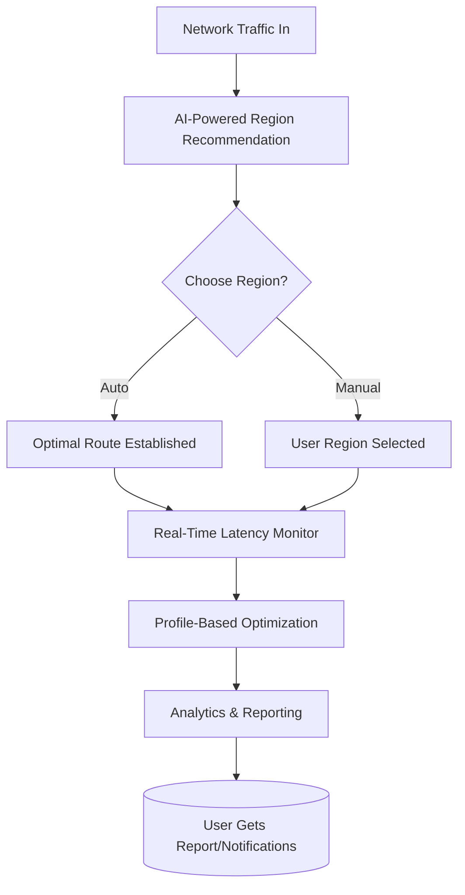

# NetPulse XR: Advanced Network Latency Analyzer & Gaming Refiner

**Unparalleled Insight. Timeless Performance.**

---

## 🚦 Download & Get Started

**Elevate your digital experience! Download NetPulse XR today:**

> **Note**: Download links are placeholders. Please visit the official site or repository page for further instructions.

---

## 🌐 Overview

NetPulse XR is the ultimate network latency analyzer and ping optimizer, crafted to empower gamers, remote workers, and latency-sensitive digital enthusiasts. Inspired by the intricate demands of modern online ecosystems, NetPulse XR doesn’t just scan, it orchestrates your network dynamics, helping you experience gaming and work online like never before.

**Keywords:** Latency analyzer, gaming optimizer, ping boost, network performance tool, advanced diagnostic utility

---

## ✨ Features at a Glance

- 🎮 **Realtime FPS Refinement**: Actively discovers and applies optimal routing paths to foster stable in-game performance.
- 🌍 **Region Selector with AI**: Choose or auto-select the best possible region for minimal ping, powered by OpenAI and Claude for smarter suggestions.
- 🗣️ **Multilingual Interface**: Seamless navigation in multiple global languages.
- 🧑‍💻 **Custom Profile System**: Build personalized latency and performance profiles for every scenario—from high-stakes esports to lag-sensitive Zoom calls.
- ☁️ **Cloud-Backed Reporting**: Visualize trends over time with rich historical data integration.
- 🕰️ **24/7 Responsive Support**: Legendary availability, with AI-augmented human assistance.
- 🔒 **Secure & Private**: All diagnostics stay on your device; no data mining or hidden tracking.
- 👾 **OpenAI & Claude API Fusion**: Leverage AI for trend prediction, automatic diagnostics, and tailored improvement plans.
- 🖥️ **Cross-Platform Brilliance**: Runs on Windows, macOS, and Linux.

---

## 🌟 SEO-Driven Benefits

NetPulse XR isn’t just another optimization tool — it’s your passport to *elite network performance*. Our AI-enhanced insights and region-based optimization deliver consistent low-latency gaming, crystal-clear remote work, and smooth online communication.

---

## 🖥️ OS Compatibility Table

| OS             | Supported | Optimized | Installation Guide |
|----------------|-----------|-----------|-------------------|
| 🪟 Windows 11/10 |    ✅    |   🚀     | [See below](#-installation)|
| 🍏 macOS 12+    |    ✅    |   🚀     | [See below](#-installation)|
| 🐧 Linux (Debian, Ubuntu, Fedora) |✅| 🚀 | [See below](#-installation)|

---

## 🧩 Key Features in Depth

### ⚡ Responsive, Adaptive UI

NetPulse XR’s sleek dashboards adjust to your preferences. Whether you crave detailed latency heatmaps or just the essentials, clarity is just a click away.

### 🛡️ AI-Driven Diagnostics

Harness the hybrid intelligence of OpenAI and Claude. Our built-in virtual assistant predicts network anomalies, recommends routes, and learns over time for deeply personalized results.

### 🌐 Multilingual Support

Bonjour! こんにちは! Hallo! Express yourself in your native language—NetPulse XR’s UI and in-app documentation are available in 15+ languages.

### 👤 Profile Management

Save and switch between latency setups for gaming, streaming, and work. Profiles are shareable for multiplayer synergy.

### 🔄 Real-Time, Insightful Analytics

Our animated graphs unfurl like digital weather maps, showing latency spikes, connection drops, and optimization outcomes.

### 💬 24/7 Support

When fate frowns and network gremlins strike at midnight, we’re awake with you—our AI chat and human team stand ready.

---

## 🗂️ Example Profile Configuration

**My_Gaming_Profile.xr**

    {
      "ProfileName": "Esports Ultra",
      "TargetGame": "Valorant",
      "PreferredRegion": "EU-West",
      "AI_PoweredAutoOptimize": true,
      "MinimumAcceptablePing": 28,
      "LatencySmoothing": true,
      "MonitorFPS": true,
      "NotificationLevel": "Verbose",
      "Language": "EN-US"
    }

---

## 🕹️ Example Console Invocation

To launch NetPulse XR with your custom gaming profile from the command line, use:

    netpulse-xr --profile "My_Gaming_Profile.xr" --ai-diagnostics --region "EU-West" --log "performance.log"

---

## 🔮 Mermaid Diagram: How NetPulse XR Works

---

## 🧠 OpenAI & Claude API Integration

- **Predictive Analytics**: Using OpenAI GPT APIs, NetPulse XR contextualizes historical lag spikes and preemptively adjusts routes.
- **Conversational Troubleshooting**: Claude-powered assistant guides you through network mysteries in natural language.
- **Smart Recommendations**: AI suggests best servers and optimal times for gaming sessions.

---

## 🚀 Installation

### Windows / macOS / Linux

1. **Download the NetPulse XR GUI or CLI package:**

   

2. **Install & Launch**  
   - **Windows**: Run the `.exe` installer.
   - **macOS**: Open the `.dmg` and drag the app to Applications.
   - **Linux**: Extract the tarball and run the `.AppImage` or use the DEB/RPM as per your distro.

3. **First Run Setup**
   - Choose your preferred language.
   - Optionally connect your OpenAI/Claude API keys for advanced features.
   - Create or import a profile.

---

## ⚖️ License

This project is licensed under the MIT License. See the [LICENSE](./LICENSE) file for details.

---

## 🏆 Contributing

Contribute new features, language packs, or enhancements—let’s shape the global internet experience together! See [CONTRIBUTING.md](./CONTRIBUTING.md) for guidelines.

---

## ⚠️ Disclaimer (2026)

NetPulse XR provides latency analysis and optimization for educational and recreational purposes only. This software neither modifies nor interferes with third-party networks or protected systems. Use responsibly and always with respect for network terms and conditions.

---

## 🚦 Download & Get Started (Again!)

Did you scroll all the way? Here’s another chance to download and transform your connectivity!

---

Let NetPulse XR chart your fastest path through the cyber-maze—because milliseconds matter, and every moment online should be epic.